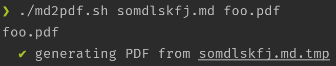

# md2pdf
Convert markdown (`.md`) to Github-styled PDFs

```
./md2pdf.sh <path/to/file.md> [path/to/file.pdf]
```


## Requires
* [`npm`](https://www.npmjs.com/)
* [`md-to-pdf`](https://www.npmjs.com/package/md-to-pdf)